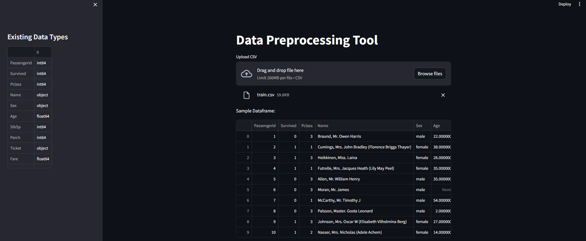
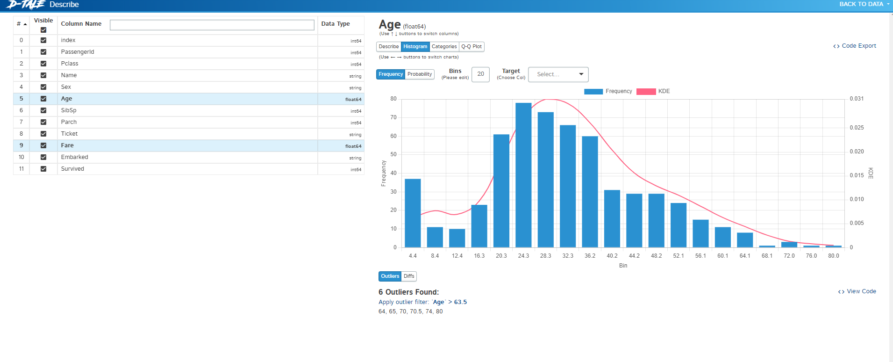
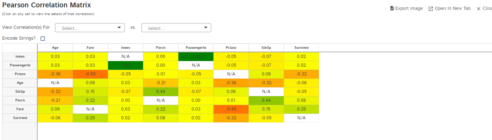
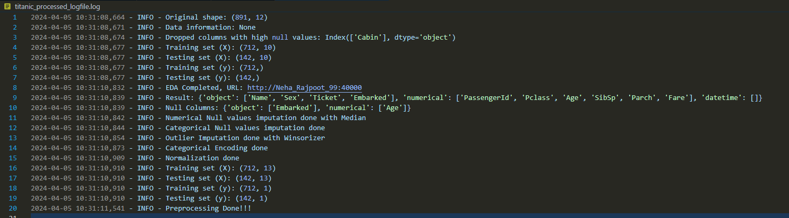
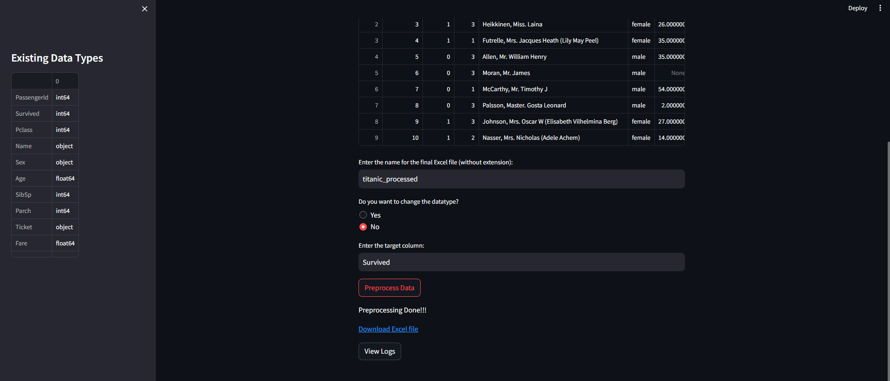

# API-for-Data-Standarization

[Datsets](https://drive.google.com/drive/folders/1exh-HBYvFW3l9CE1w3RalxG08_O-LHHk?usp=sharing)

## How to run the notebook:

1. create a virutal environment with (python -m venv --python=python3.10 myenv) / Activate it with (myenv\Scripts\activate)
2. load the requirements.txt and install requirememts with (pip install -r requirements.txt)
3. load the app.py and the try_main.py to run the streamlit app. You can run the app with (streamlit run app.py)
4. To test some cases in the backend, use the main.py and test_cases.py
5. Use the test_cases.py to give the datasets for preprocessing.
6. We need to give 2 main inputs to the class module : The dataframe and the file name to save the excel file as. With the same file name a log file will be created including all the processes done.
7. While we run the module, we have an option if we need to change the datatypes or not, if yes; then we need to give the columns in comma separated form and then the daatype to be changed to in the same order as the columns.
8. Last input is the target column which we have to provide for spliting the data into Train & Test set.

 ## Demo Screenshots:

